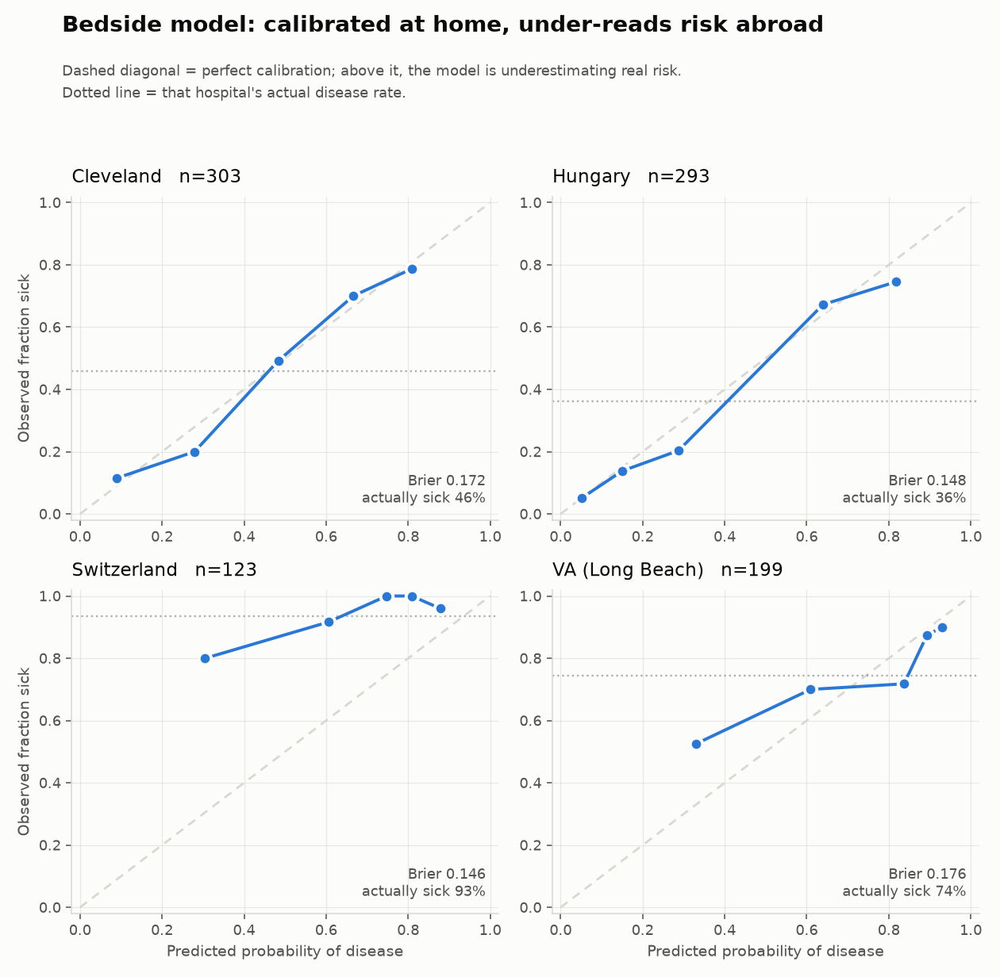
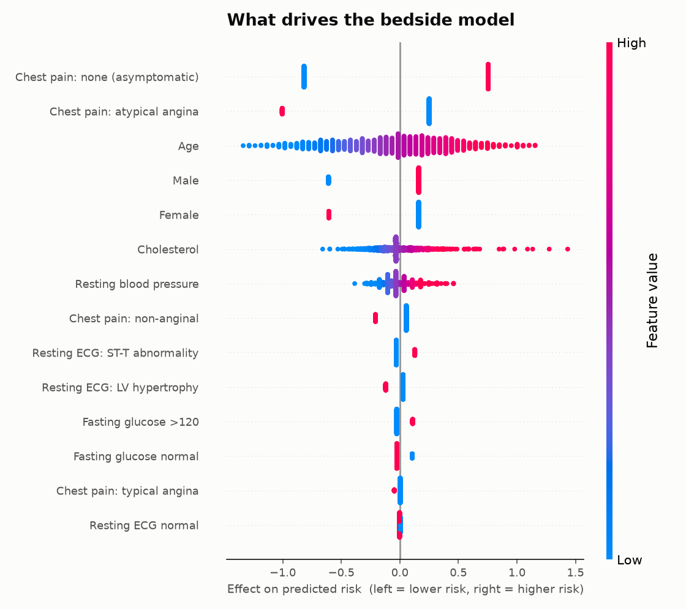

# Heart Disease Prediction — an honest multi-site evaluation

Most published results on the UCI heart disease data report ~95% accuracy. This project
shows why that number is an artifact, and what the result looks like when the model is
tested the way a hospital would actually deploy it.

**Headline finding:** a model using only seven bedside measurements — things any clinic
can collect in ten minutes — reaches **AUROC 0.71–0.85** when tested on a hospital it has
never seen. Adding thallium scans and angiography results, the two features that dominate
nearly every published analysis, **adds nothing** once you evaluate across hospitals.



## The data

920 patients from four hospitals, distributed by UCI. Almost all published work uses only
the 303-patient Cleveland subset.

| Site | Patients | Disease prevalence |
|---|---|---|
| Cleveland | 303 | 45.9% |
| Hungary | 294 | 36.1% |
| VA Long Beach | 200 | 74.5% |
| Switzerland | 123 | 93.5% |

That prevalence spread is the whole problem. A model calibrated for Cleveland's 46%
produces meaningless probabilities in Switzerland's 94%.

## Four traps in this dataset

**1. `chol == 0` is a missing-value code, and it leaks the label.**
Cholesterol is recorded as `0` for 100% of Switzerland and 24.5% of VA. Nobody has zero
cholesterol — it means "not measured". Because Switzerland is 93.5% positive:

```
P(disease | chol == 0) = 0.884
P(disease | chol >  0) = 0.477
```

A model trained on the raw pooled data learns *"cholesterol is zero → heart disease"*,
which is really *"this patient is Swiss"*.

**2. `dropna()` silently deletes three of the four hospitals.**
The standard cleaning line takes 920 patients → 299, of which 297 are Cleveland. Work
that appears to be multi-site is Cleveland-only.

**3. `ca` is read off the same test that defines the label.**
The target is ">50% narrowing on angiography". `ca` is "number of vessels visible on
fluoroscopy" — the same procedure. The single rule `ca > 0 → disease` scores **0.742
accuracy** on Cleveland with no model at all. It is also unavailable for 98% of patients
outside Cleveland.

**4. Missingness indicators re-introduce the leak.**
Standard clinical-ML practice is to add "was this value missing?" flags, because the tests
a doctor orders are informative. Here, missingness is a property of the *hospital*, not the
patient — so `chol_missing` is just the Switzerland flag wearing a disguise. Deliberately
omitted, and the reasoning is documented.

## Method

- **Leave-one-hospital-out validation.** Train on three sites, test on the fourth, four
  times. A random split over pooled data lets the model memorise site quirks and then meet
  them again at test time.
- **`source` is never a feature** — it decides the split, nothing else.
- **Three feature tiers**, matching how care actually escalates:
  - `bedside` — age, sex, chest pain type, BP, cholesterol, fasting glucose, resting ECG
  - `stress` — + treadmill test (max HR, exercise angina, ST depression, ST slope)
  - `imaging` — + thallium scan, angiographic vessel count
- **All preprocessing inside a scikit-learn `Pipeline`**, so imputation and scaling are
  fitted on training data only.
- **Decision threshold chosen on training data** to hit 90% sensitivity — never tuned on
  the test site.

## Results

### AUROC by tier and held-out hospital

| Held out | bedside | stress | imaging |
|---|---|---|---|
| Cleveland | 0.817 | **0.861** | 0.835 |
| Hungary | 0.848 | 0.895 | **0.897** |
| Switzerland | **0.768** | 0.754 | 0.760 |
| VA | 0.705 | **0.748** | 0.725 |
| **Mean** | 0.785 | **0.815** | 0.804 |

The treadmill test earns its place (+0.03). **Imaging does not** — it scores *below* the
stress tier on average, despite being the most expensive and most invasive tier, because
those features are absent at the sites being tested on.

### Clinical metrics, bedside model, at 90% target sensitivity

| Held out | n | prevalence | AUROC | sensitivity | specificity | PPV | NPV | missed cases |
|---|---|---|---|---|---|---|---|---|
| Cleveland | 303 | 0.46 | 0.817 | 0.863 | 0.616 | 0.656 | 0.842 | 19 |
| Hungary | 293 | 0.36 | 0.848 | 0.792 | 0.775 | 0.667 | 0.868 | 22 |
| Switzerland | 123 | 0.93 | 0.768 | 0.922 | 0.500 | 0.964 | 0.308 | 9 |
| VA | 199 | 0.74 | 0.705 | 0.980 | 0.275 | 0.797 | 0.824 | 3 |

We asked for 90% sensitivity and got 79–98%. **The threshold does not transfer between
hospitals** — visible only because whole sites were held out.

Note Switzerland's PPV 0.96 against NPV 0.31: the same model at the same threshold means
completely different things in a population where 93% are sick.

### Why accuracy is the wrong metric here

| Site | Accuracy of "just say sick, always" |
|---|---|
| Switzerland | **93.5%** |
| VA | **74.5%** |
| Hungary | 63.9% |
| Cleveland | 54.1% |

### Calibration

Brier score (lower is better) against a baseline that always predicts the training
prevalence:

| Site | Model | Baseline |
|---|---|---|
| Cleveland | **0.172** | 0.268 |
| Hungary | **0.148** | 0.310 |
| Switzerland | **0.146** | 0.255 |
| VA | **0.176** | 0.250 |

The model beats the baseline everywhere, but the figure above shows it systematically
**under-reads risk** at Switzerland and VA — it can rank patients correctly while its
probabilities are wrong.

## What the model learned



| Feature | Effect |
|---|---|
| Chest pain: none (asymptomatic) | **+1.573** |
| Chest pain: atypical angina | −1.255 |
| Male | +0.771 |
| Age | +0.480 |
| Cholesterol | +0.209 |

The strongest predictor is **having no chest pain**. This is *silent ischemia* — significant
coronary disease frequently presents without classic angina, especially in older and
diabetic patients — compounded by selection effects, since everyone here was referred for
cardiac testing. `Male` and `Age` match known cardiac epidemiology, which is a useful sign
the model learned physiology rather than artifacts.

## Limitations

- **Not clinically validated.** Research exercise on a 1988 dataset. Not for clinical use.
- **Probabilities do not transfer** between populations with different disease prevalence.
  Any deployment needs local recalibration.
- **Cholesterol is imputed for 202 of 918 patients**, so its modest SHAP contribution
  partly reflects median-fill, not biology.
- **All four hospitals are referral populations.** Performance in an unscreened general
  population is unknown and would likely be worse.
- **1988 data.** Diagnostic criteria, imaging, and treatment have all changed since.

## Reproducing

```bash
pip install -r requirements.txt
jupyter notebook notebooks/01_multisite_analysis.ipynb
```

## Data source

Detrano, R. et al. *International application of a new probability algorithm for the
diagnosis of coronary artery disease.* American Journal of Cardiology, 1989.
[UCI Machine Learning Repository](https://archive.ics.uci.edu/dataset/45/heart+disease)
